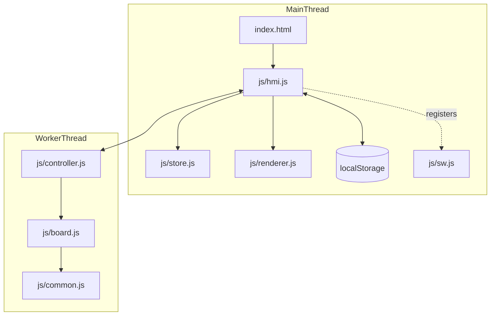

# Software Architecture - Yet Another Code Breaker

## 1. System Overview

The application is a browser-based single-page game organized into four layers:

- Pure rules core: `javascript/html5/src/js/board.js`, `javascript/html5/src/js/common.js`
- Worker orchestration: `javascript/html5/src/js/controller.js`
- UI state and persistence: `javascript/html5/src/js/store.js`, `javascript/html5/src/js/hmi.js`
- View rendering and shell: `javascript/html5/src/js/renderer.js`, `javascript/html5/src/index.html`, `javascript/html5/src/css/index.css`

Key architectural goals:

- deterministic and testable rules
- immutable state transitions
- isolated side effects for DOM, storage, timers, and worker messaging
- minimal coupling between rules, transport, and rendering

## 2. Functional Requirements Derived From `doc/rules.md`

### 2.1 Gameplay

- The player must deduce a hidden code within a limited number of attempts.
- Each submitted guess returns:
  - exact count: correct symbol in the correct slot
  - misplaced count: correct symbol in the wrong slot
- Input is handled through a keypad with value buttons, `Backspace`, and `Enter`.

### 2.2 Options

- Secret length: `4` or `5`
- Symbol count: `6` to `10`
- Representation: numbers, colors, letters, symbols
- Attempt cap: `8`, `10`, `12`, or unlimited
- Frontend language: English, German, French, Portuguese, Spanish, Italian

### 2.3 Result States

- Win state shows a success message and animated celebration
- Loss state shows a failure message, reveals the secret, and animates the final guess with a tilt effect

### 2.4 Persistence

- Highscores are stored per day, week, and month
- Scores are tracked by attempts plus elapsed time from first input to solved game
- Settings persist locally between sessions

### 2.5 Shell Behavior

- Main navigation exposes `New Game`, `Rules`, `Options`, and `About`
- `Rules`, `Options`, and `About` are separate pages with the game board hidden while shown
- `OK`, `Back`, `Close`, and `New Game` return to the current board display

## 3. Domain Model

### 3.1 Board State

`board.js` owns the immutable gameplay state:

- `settings`
- `secret`
- `currentGuess`
- `history`
- `status`
- `firstInputAt`
- `finishedAt`
- derived data such as `keypad`, `secretDisplay`, `currentGuessDisplay`, `attemptsRemaining`, and `canSubmit`

### 3.2 Input Actions

The rules core accepts four action types:

- `append`
- `backspace`
- `clear`
- `submit`

All rule transitions return a new board snapshot or the same snapshot for invalid/no-op actions.

## 4. Message Flow

### 4.1 Worker Protocol

Requests from `hmi.js` to `controller.js`:

- `start`
- `restart`
- `move`
- `sync`
- `action_by_ai` (compatibility no-op)

Responses from `controller.js` to `hmi.js`:

- `redraw`
- `human_to_move`

Both responses carry the full board snapshot.

### 4.2 Runtime Flow

1. `hmi.js` restores settings and highscores.
2. The worker starts a new board from normalized settings.
3. The UI store receives worker snapshots.
4. `renderer.js` rebuilds the visible game board from the immutable snapshot.
5. On a solved board, `hmi.js` records highscores.

## 5. Dependency Diagram

## 6. Testing Strategy

- Unit tests cover pure helpers, rules transitions, store behavior, worker handling, and HMI persistence wiring.
- Playwright E2E tests cover:
  - shell load
  - page navigation
  - settings updates
  - guess submission
  - highscore reset confirmation flows
- Vitest coverage thresholds are enforced at `98%` for statements, branches, functions, and lines
  over the rule and orchestration modules.

## 7. PWA Packaging

- `manifest.json`, `manifest.webapp`, and `manifest_hosted.webapp` reflect Yet Another Code Breaker branding
- `config.xml` reflects the renamed Cordova package metadata
- `js/sw.js` caches the Code Breaker shell and icon assets for offline startup
